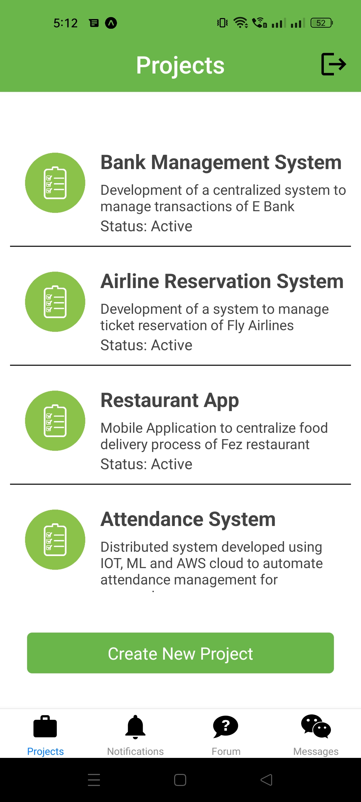
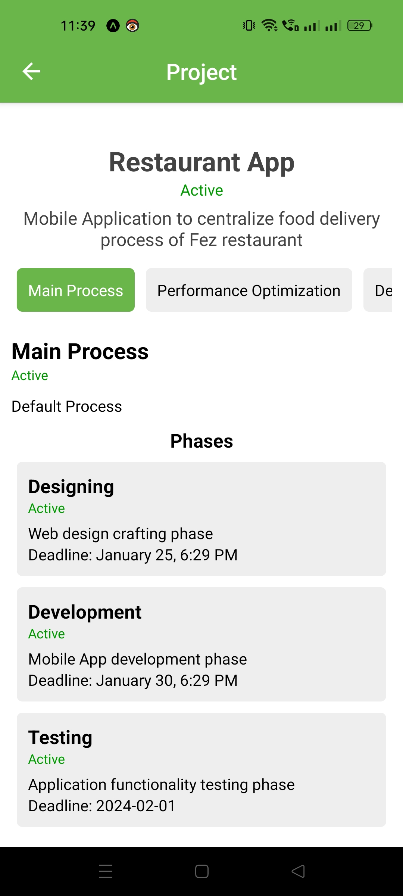
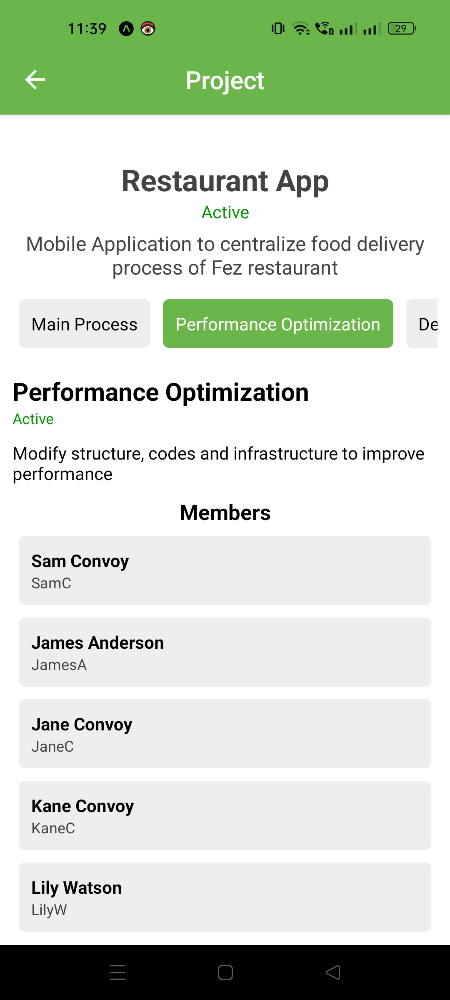
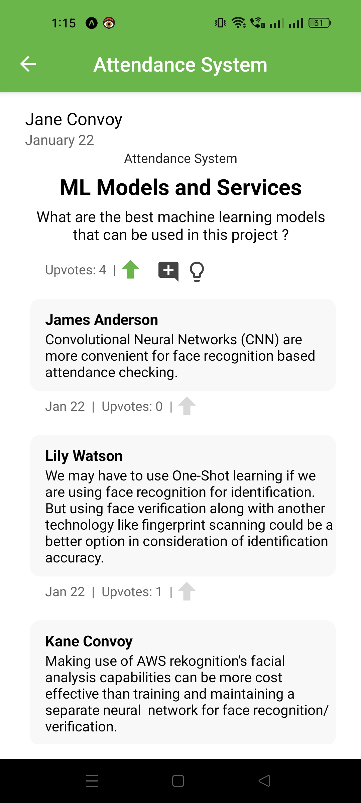
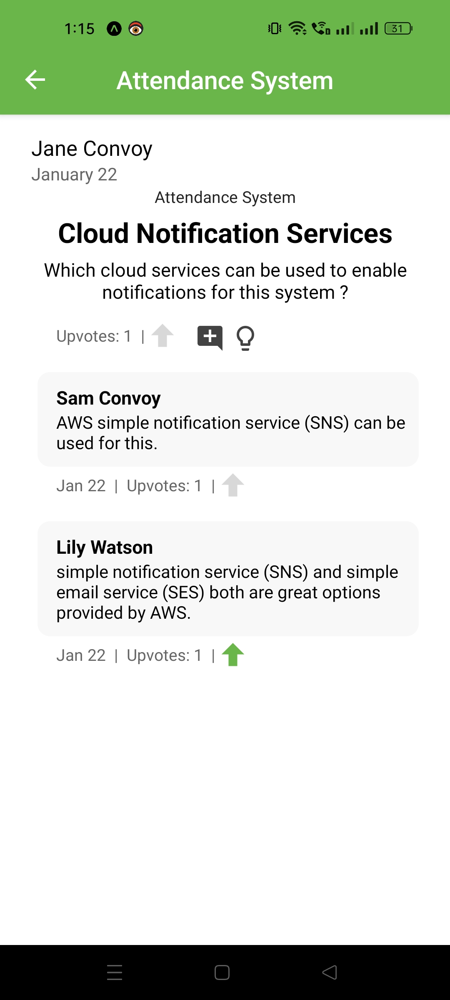
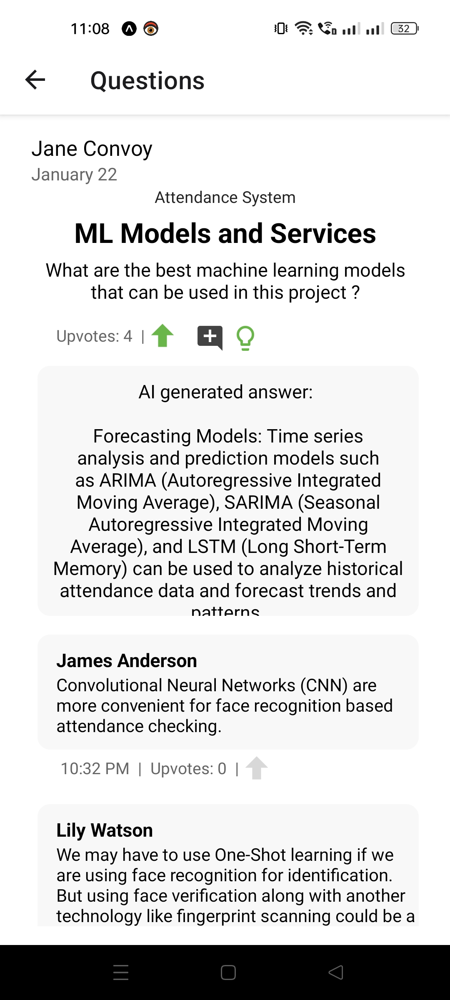
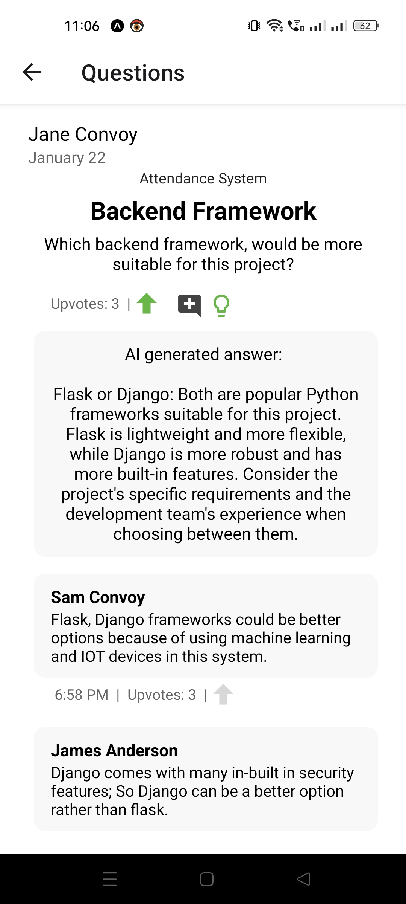
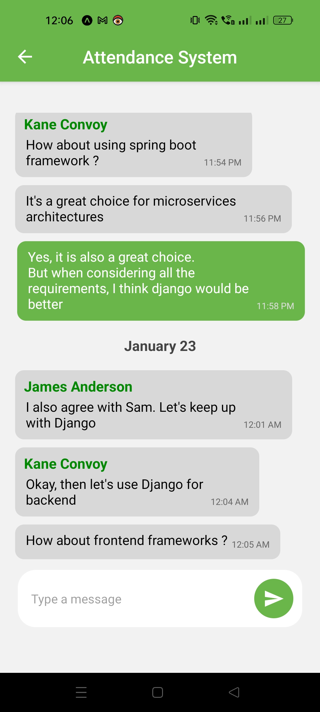

# Project Management App
The application was engineered to facilitate real-time project planning and enhance team coordination efficiency. 

Project management functionalities have been implemented at various hierarchical levels, including processes, phases, and tasks.
The implementation enforces the principle of least privilege permissions, ensuring that administrators and members at each level possess only the necessary permissions to modify the project's state.

The platform incorporates forums where project members can post queries related to encountered issues, receiving responses from experts within the project community. Members can utilize upvoting mechanisms to elevate the visibility of significant questions and highlight superior answers.

Integration with the Google Gemini API, coupled with prompt engineering techniques, enables the generation of context-aware responses for forum questions.

Private chats for person-to-person interactions and group chats at both project and phase levels have been provided for streamlined team management. The integration of GraphQL subscriptions ensures real-time communication in these chats, minimizing any communication delays.

