<h1 align="center">🧑‍💻 Project Management App 🧑‍💻</h1>

<h2 align="center">🏢 Backend Architecture 🛠️</h2>

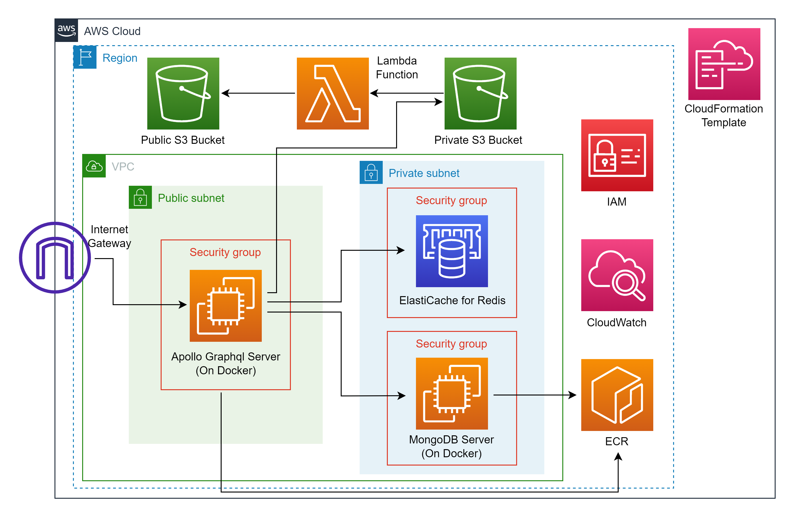

<h2 align="center">📚 Project Description 📚</h2>

This project encompasses a mobile application designed to assist users in managing their projects, alongside a backend system that delivers essential services to the mobile application. The mobile application, developed using React Native, offers users the following functionalities:
- User Registration and Profile Updates
- User Authentication and Authorization
- Creation of Projects with multiple hierarchical levels (Processes, Phases, Tasks)
- Invitation of other users to join projects
- Assignment of project members to various levels within the project
- Management of projects at each level, including the designation of Managers and Admins
- Task assignment to members at the relevant project level
- Updating of status, priority, and due date/time at each level by authorized roles
- Viewing project progress
- Creation of forums for each project and posting of questions/answers
- Upvoting and downvoting of questions/answers in forums
- Access to AI-generated answers for forum questions
- Real-time chat messaging with other users, available in both private and group settings

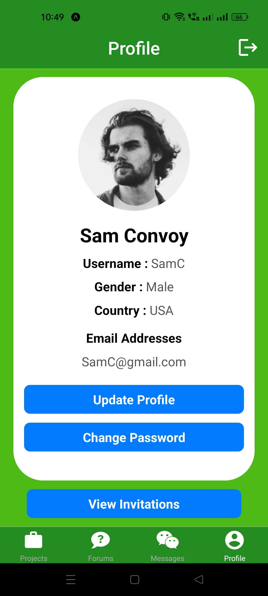

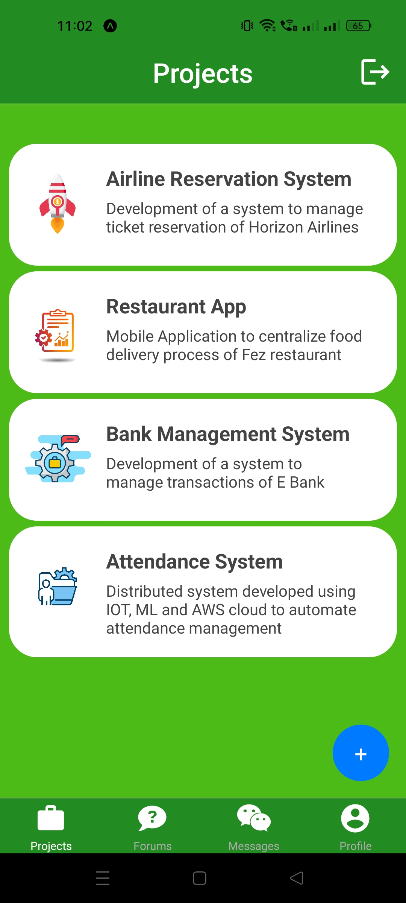
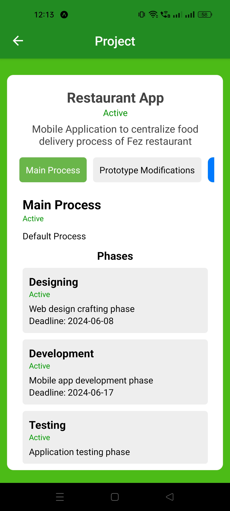
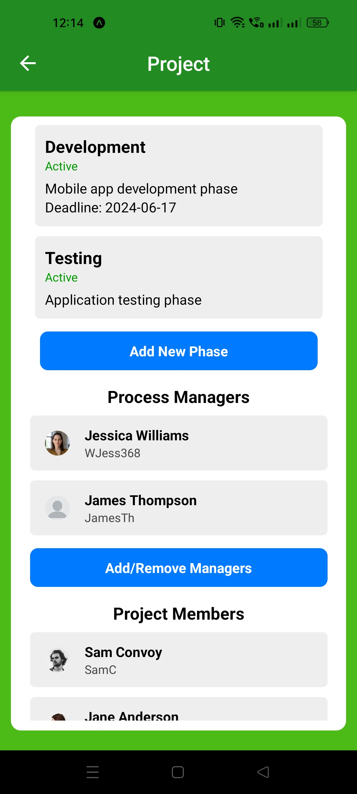

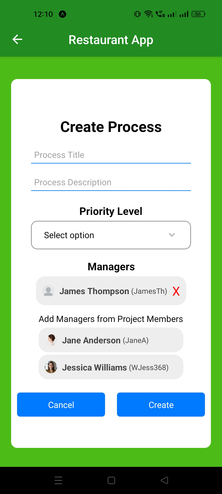
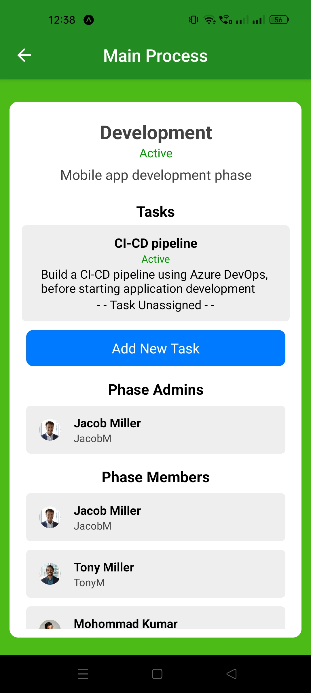
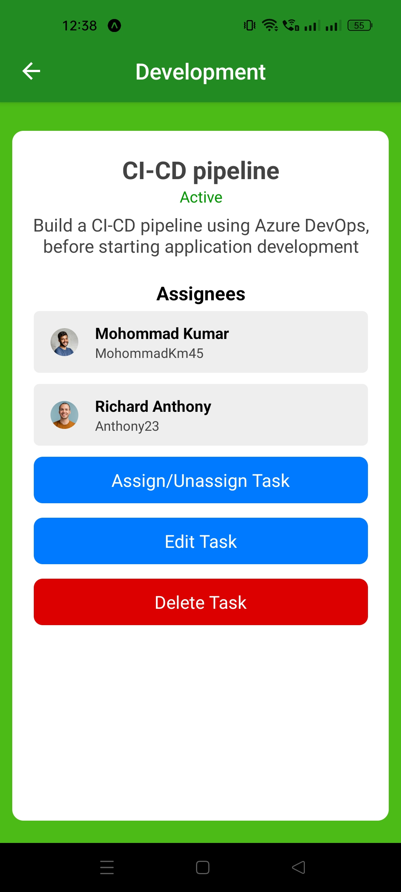

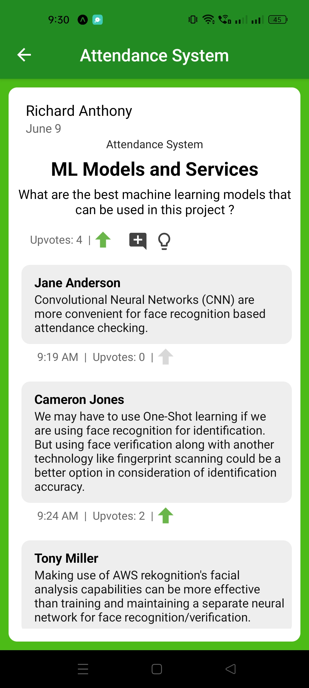
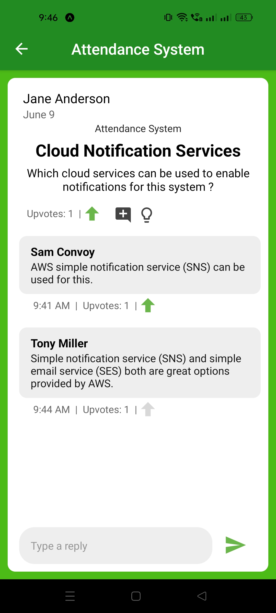

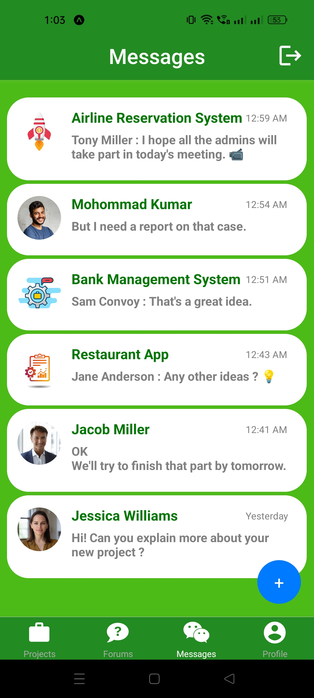
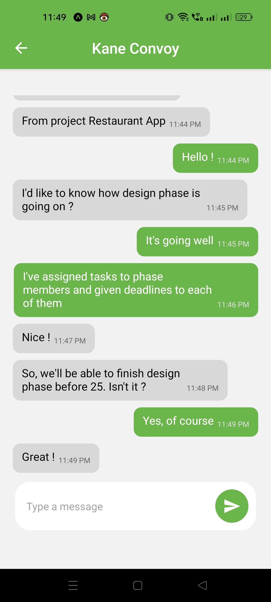
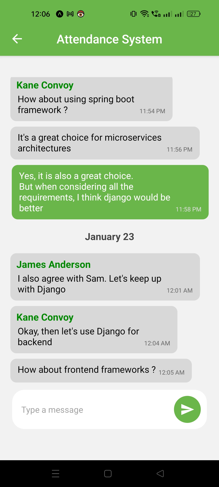

