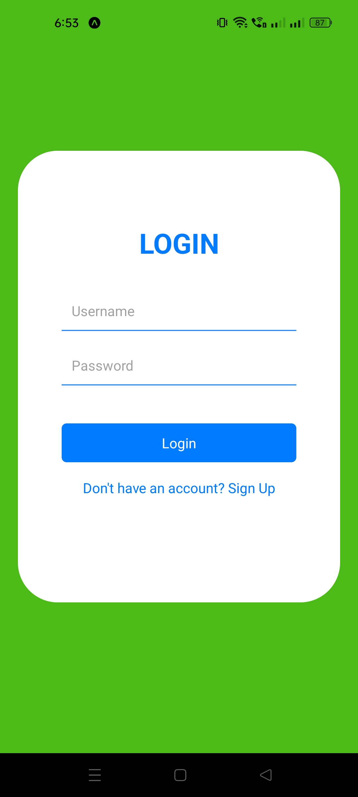
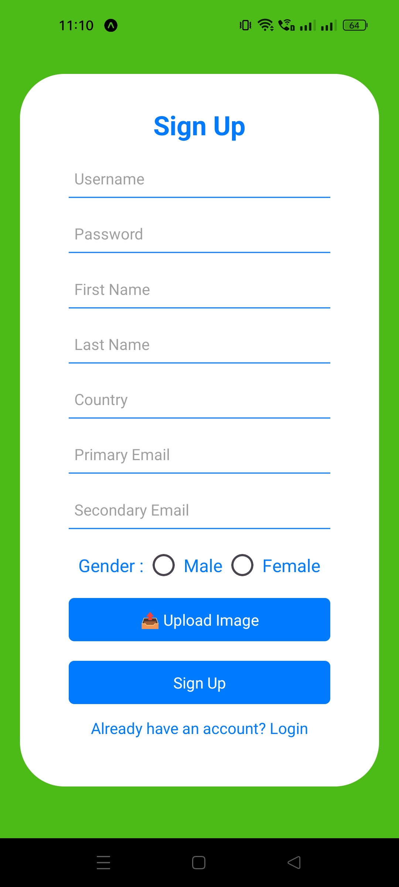
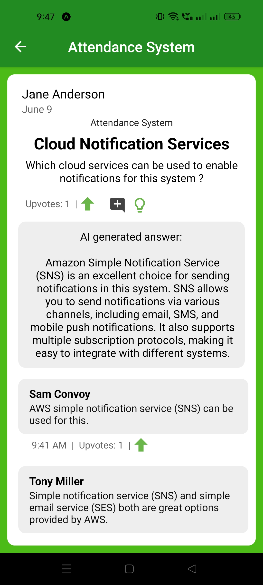

<h1 align="center">🧑‍💻 Project Management App 🧑‍💻</h1>

<h2 align="center">🏢 Backend Architecture 🛠️</h2>

<h2 align="center">📚 Project Description 📚</h2>

This project encompasses a mobile application designed to assist users in managing their projects, alongside a backend system that delivers essential services to the mobile application. The mobile application, developed using React Native, offers users the following functionalities:
- User Registration and Profile Updates
- User Authentication and Authorization
- Creation of Projects with multiple hierarchical levels (Processes, Phases, Tasks)
- Invitation of other users to join projects
- Assignment of project members to various levels within the project
- Management of projects at each level, including the designation of Managers and Admins
- Task assignment to members at the relevant project level
- Updating of status, priority, and due date/time at each level by authorized roles
- Viewing project progress
- Creation of forums for each project and posting of questions/answers
- Upvoting and downvoting of questions/answers in forums
- Access to AI-generated answers for forum questions
- Real-time chat messaging with other users, available in both private and group settings

<h2 align="center">📱 App Preview Screenshots 📱</h2>

<h3 align="center">👤 User Authentication and Profile Screens 👤</h3>

<h3 align="center">📝 Project Management Screens 📝</h3>

<h3 align="center">📡 Chat Screens 📡</h3>

<h3 align="center">📚 Forum Screens 📚</h3>

<h2 align="center">🔧 Technical Implementations 🔧</h2>

<h3 align="center">📡 Real-time Communication 📡</h3>
The application leverages GraphQL subscriptions to facilitate real-time communication between users. Chat messages are categorized into private, phase, and project chats. When a user sends a message from the mobile app, it is transmitted to the backend server via a GraphQL mutation. The server then determines the chat type and publishes the message to the appropriate subscribers. Subscriber applications receive the message, ascertain its type, and update the chat stack accordingly.

<h3 align="center">📚 AI-generated Answers 📚</h3>
When a user seeks an answer to a question in the forum, the mobile application notifies the backend server. The server retrieves relevant data from the database to construct a prompt containing the question and its context. This prompt is then sent to the Gemini API to generate a response. The generated answer is post-processed and subsequently sent back to the mobile application, where it is displayed to the user.

<h3 align="center">🖼️ Image Upload Mechanism 🖼️</h3>
When a user selects an image to upload, the mobile application sends a request to the backend server for a signed URL. The backend server generates a pre-signed URL for the image and returns it to the mobile application. The mobile application uses this signed URL to upload the image to a private S3 bucket. The creation of a new object in the private S3 bucket triggers a Lambda function, which processes the image and transfers it to a public S3 bucket. Upon completion of the upload, the mobile application notifies the backend server, which then updates the pre-signed URL to point to the image object in the public S3 bucket. This modified URL is stored in the database and sent back to the mobile application, which uses it to display the image with public access.
